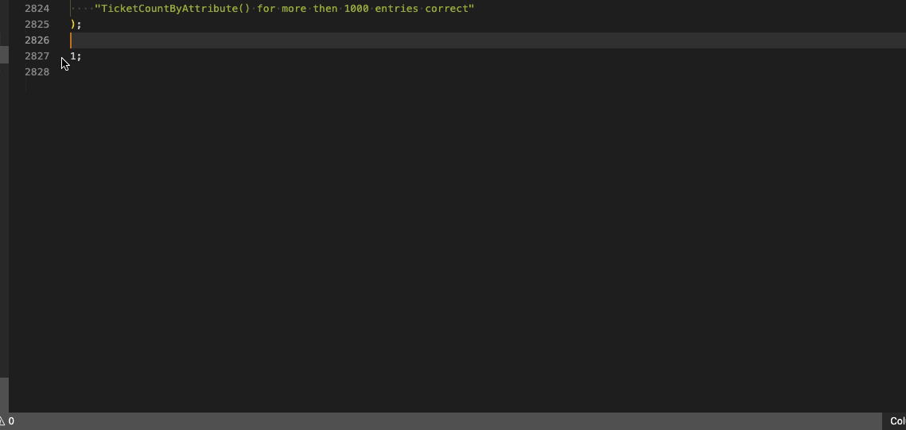
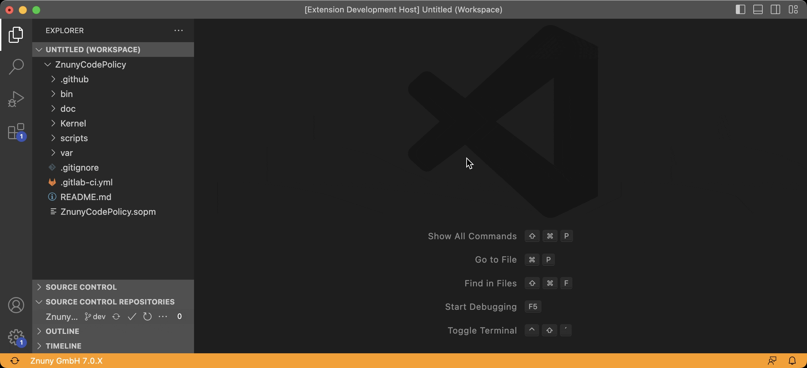
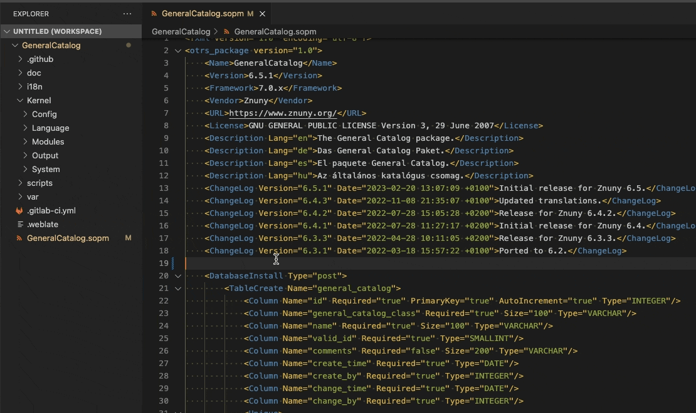
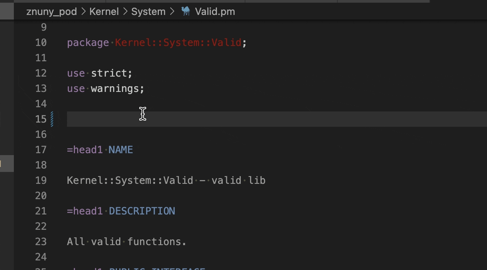
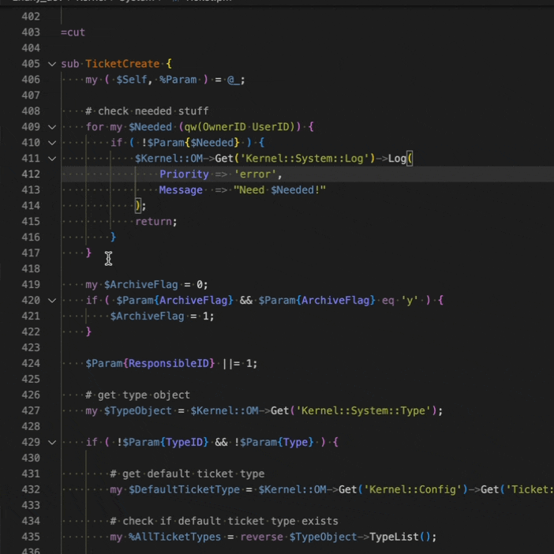
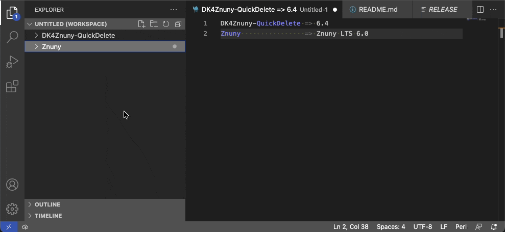

# Znuny

**Znuny** is an extension that helps you to make Znuny development easier, faster and more error-free.

| Repository | GitHub | Visual Studio Marketplace |
| ------ | ------ | ------ |
|  |   |   |
|  |   |  |
|   |  |   |
|   |  |   |

| Versions | Status |
| ------ | ------ |
|    <br>   | [](https://github.com/dennykorsukewitz/VSCode-Znuny/compare/1.1.3...dev)  [](https://github.com/dennykorsukewitz/VSCode-Znuny/actions/workflows/snippet.yml)  |

## Features

- [AddFolderToWorkspace](#addfoldertoworkspace)
- [Customizer](#customizer)
- [GenerateFilelist](#generatefilelist)
- [ObjectDependencies](#objectdependencies)
- [QuoteWithMarker](#quotewithmarker)
- [Snippets](#snippets)
- [StatusBar](#statusbar)

---

### Snippets


Znuny code snippets for fast, consistent and error free coding.



#### Static


Statically created snippets.

- CodePolicy
- ConfigXML
- Customizing
- Debugging
- DynamicFields
- GitLab
- Language
- Licensing
- Needed
- Perl
- POD
- Selenium
- VariableCheck

#### Generated


Snippets created generically using the existing Perl POD.

```perl
snippets
│
└───Functions
│   └───ConfigObject
│   │       $ConfigObject->Get()
│   │       $ConfigObject->Set()
│   │
│   └───TicketObject
│           $TicketObject->TicketGet()
│           $TicketObject->TicketSearch()
│           ...
│
└───Modules
│       AgentTicketZoom
│       CustomerTicketOverview
│       ...
│
└───ObjectManager
        ConfigObject
            my $ConfigObject = $Kernel::OM->Get('Kernel::Config');
        TicketObject
            my $TicketObject = $Kernel::OM->Get('Kernel::System::Ticket');
        ...
```

---

### AddFolderToWorkspace

This Function provides a searchable list of folders (Workspaces) that can be added to the current VSC Workspace. All configured folders will be displayed.

**Shortcut:** ```strg + alt + z, p```<br>
**Command:**  ```Znuny: Add Folder to Workspace.```

#### Settings

`Preferences -> Settings -> Extensions -> Znuny`

| Name | Description | Default Value |
| - | - | - |
| znuny.addFolderToWorkspace.workspaces | All searchable Workspaces. | /workspace/ |


---

### Customizer

This function fetches Znuny files from GitHub and adds origin to header.

```perl
# $origin: Znuny - 7775216b80452a6ce2267812a25bf23ae786ae57 - Kernel/System/Ticket.pm
```

**Shortcut:** ```strg + alt + z, c```<br>
**Command:**  ```Znuny: Fetch Znuny files from GitHub.```

Opens a project, branch and file selection list to chose a framework or addon file from. The file will get fetched live from the selected GitHub branch and added to the (selected) folder. The origin tag will be added automatically to the file header for you. The file will also be automatically added to the 'Custom/' directory in case it's a file with one of the file extensions '.pm', '.dtl' or '.tt'.
If the copyright is set in the settings, it will be added as well.

The GitHub API is limited to 60 requests per hour for non authorized requests.
If you need more requests, please create an issue on the use of credentials.

#### Settings

`Preferences -> Settings -> Extensions -> Znuny`

| Name | Description | Default Value |
| - | - | - |
| znuny.customizer.copyright | Znuny Customizer Copyright. This Copyright will be added to the Customizer file under the Znuny Copyright. |  |
| znuny.customizer.repositories | List of possible GitHub repositories. | Znuny|FAQ|... |



---

### GenerateFilelist

Inserts the SOPM Filelist content containing all files of a selectable project.<br>
The following file types will be added: `pm | tt | t | xml | js | html.tmpl`

The function can be executed only in the `.sopm` file.

**Shortcut:** ```strg + alt + z, f```<br>
**Command:**  ```Znuny: Insert Filelist to SOPM.```

#### Settings

`Preferences -> Settings -> Extensions -> Znuny`

| Name | Description | Default Value |
| - | - | - |
| znuny.generateFilelist.mode | Znuny Generate Filelist Mode is used in GenerateFilelist function.<br>It defines how the file list should be generated.<br><br>**File** => Adds only every single file without `<Filelist>`.<br>**Filelist** => Adds the complete filelist with `<Filelist>`. | File |



---

### ObjectDependencies

This function inserts the `@ObjectDependencies` array by parsing the file content. Only regular used OM (ObjectManager) calls are supported.

**Shortcut:** ```strg + alt + z, d```<br>
**Command:**  ```Znuny: Insert @ObjectDependencies.```



---

### QuoteWithMarker

This function quotes the selected area and adds a custom marker to it.

`QuoteWithMarker` can be very useful especially for custom files `Custom/**`.

**Shortcut:** ```strg + alt + z, q```<br>
**Command:**  ```Znuny: Quote with Marker.```

Works with active Perl, JavaScript and HTML syntax.

#### Settings

`Preferences -> Settings -> Extensions -> Znuny`

| Name | Description | Default Value |
| - | - | - |
| znuny.quoteWithMarker.codeMarker | Znuny Code Marker used in QuoteWithMarker function. | Znuny |



---

### StatusBar

The status bar gets an additional **Znuny** item and the entire status bar is displayed in the Znuny color  \
if the active file is a "Znuny file".

- If the active file belongs to a **Znuny framework** ("Znuny file") in the workspace, the **product name** and **version** are displayed from the RELEASE file.
- If the active file belongs to a **Znuny package** ("Znuny file") in the workspace, the **vendor** and the largest **framework version** are displayed from the SOPM file.

The status bar is updated with every active file change.

**Shortcut:** ```strg + alt + z, v```<br>
**Command:**  ```Znuny: Show Znuny Version.```

#### Settings

`Preferences -> Settings -> Extensions -> Znuny`

| Name | Description | Default Value |
| - | - | - |
| znuny.statusBar.enabled                       | Defines when the StatusBar should be updated. <br><br> **On**: Always active.<br> **On Command**: Activated only by a command.<br> **On ChangeActiveTextEditor**: Activated only by change of active TextEditor.<br> **Off**: Not active. | On |
| znuny.statusBar.statusBar.background          | Znuny Status Bar background color. | #ff9b00 |
| znuny.statusBar.statusBar.foreground          | Znuny Status Bar foreground color. | #000000 |
| znuny.statusBar.statusBar.foregroundZnuny     | Znuny Status Bar foreground color for Znuny Version Item. | #ffffff |
| znuny.statusBar.statusBarItem.hoverBackground | Znuny Status Bar hoverBackground color. | #ffc062 |



---

## Installation

To install this extension, you have **three** options:

### 1. Search Extension in Marketplace

Search and install online extension via VSC extensions menu.

`Code` -> `Preferences` -> `Extensions` simply search for `Znuny` to install.

### 2. Install via vsix file

Download latest [vsix file](https://github.com/dennykorsukewitz/VSCode-Znuny/releases) and install via extensions menu.

`Code` -> `Preferences` -> `Extensions` -> `Views and More Action` -> `Install from VSIX`.

### 3. Source code

Download archive with the latest [release](https://github.com/dennykorsukewitz/VSCode-Znuny/releases) and unpack it to VisualStudioCode extensions folder
`$HOME/.vscode/extensions/`.

---

## Download

For download see [VSCode-Znuny](https://github.com/dennykorsukewitz/VSCode-Znuny/releases)

---

Enjoy!

Your [Denny Korsukéwitz](https://github.com/dennykorsukewitz) 🚀
